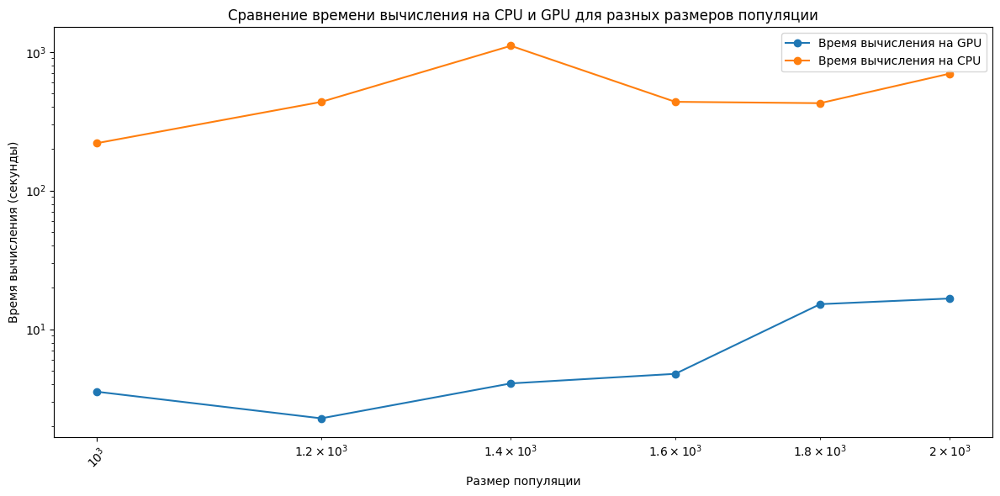
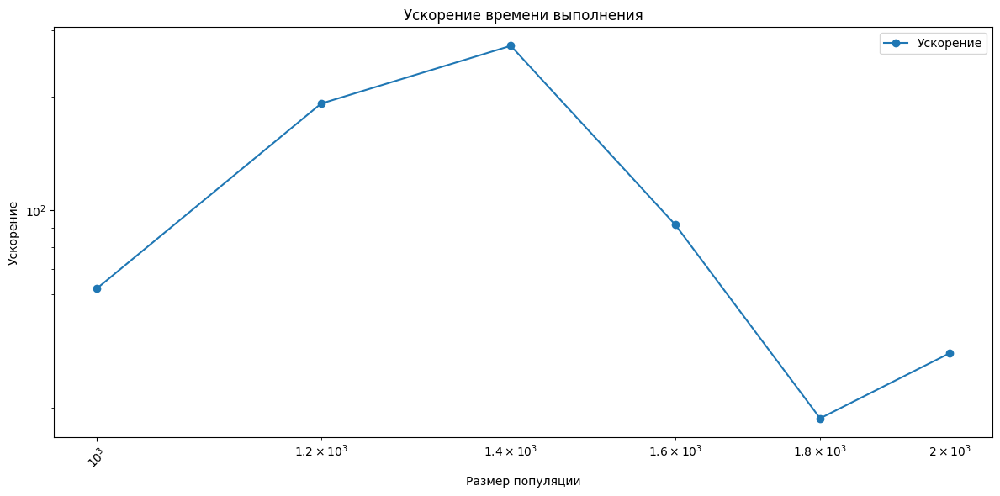
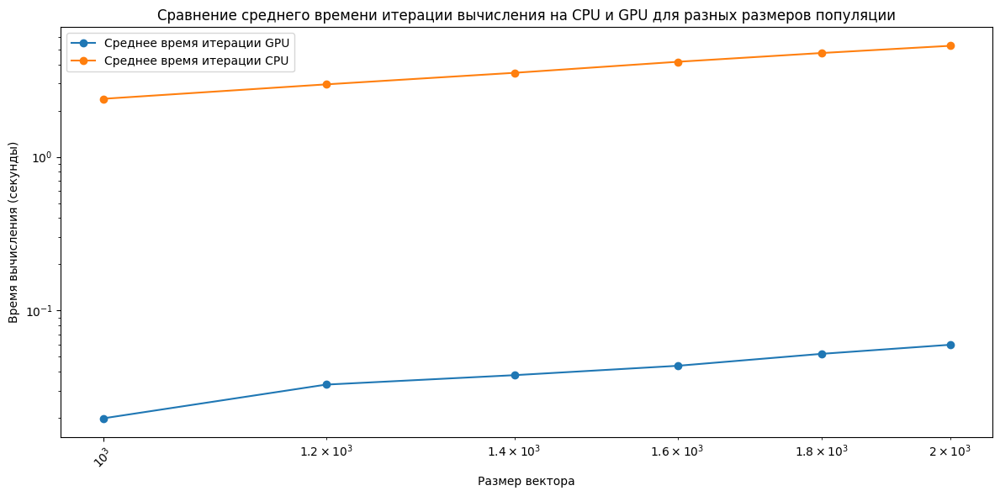
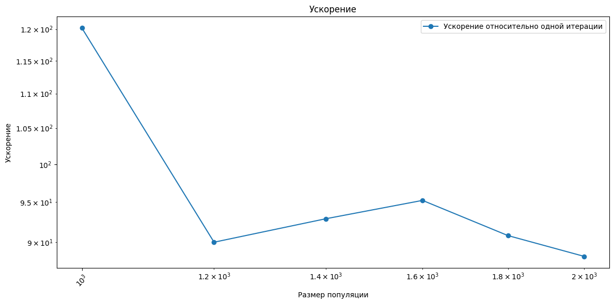

<h1>Genetic Algorithm</h1>
<h2>Постановка цели эксперимента</h2>

Цель – исследовать ускорение генетического алгоритма с использованием полиномиальной аппроксимации на CUDA относительно последовательной реализации.

Задачи:
1.	Рассчитать время, достигаемое последовательной реализацией алгоритма.
2.	Рассчитать время и ускорение, достигаемое с использованием написанной параллельной реализации на CUDA.
3.	Проанализировать результат, сделать выводы.

<h2>Инструментальные средства эксперимента</h2>
<h3>Программные средства</h3>
Язык программирования – C++. 

<h3>Среда выполнения - Google Colab(https://colab.research.google.com/drive/1uPYv0obiX5o4zJf-kTQ3y22g0jBMlvIx?usp=sharing)</h3>


Входные значения:
1. Набор точек (500-1000)
2. Размер популяции (1000-2000)
3. Мат.ожидание и дисперсия мутации
4. Максимальное количество итераций генетического алгоритма, максимальное количество итераций, при котором не меняется лучшее значени fitness


Основные шаги генетического алгоритма.
1. Генерация начальной популяции.
2. Селекция (отбор лучших индивидов, функцией fitness, тут ищется ошибка).
3. Скрещивание (создание нового этапа популяции).
4. Мутации (случайное изменение значений в полиноме).

Код последовательной реализации(с пояснениями):

Коэффициенты необходимые для генерации начальных значений:
```
const double left = -5.0; // граница слева
const double right = 5.0; // граница справа
const int number_points = 500; // количество точек
const double step = (right - left)/number_points; // шаг для x
const int POPULATION_SIZE = 1000; // Размер популяции
const int MAX_GENERATIONS = 1000; // Максимальное количество поколений
const double MUTATION_RATE = 0.01; // Вероятность мутации
const double TARGET_ERROR = 1e-5; // целевая ошибка
const int POLYNOMIAL_DEGREE = 4; // степень полинома
std::vector<double> TARGET_POLYNOM(POLYNOMIAL_DEGREE+1); // Создаем полином, наполненый случайными значениями, чтобы сгенерировать точки
const double COEF_SELECTION = 0.5; // коэффициент отбора
count int maxConstIter = 50; // количество шагов генетического алгоритма, при которой 
// Для генерации точек, и фукнций значений
std::vector<double> POINTS;
std::vector<double> FUNCTION_VALUES;

// Случайные значения
std::random_device rd;
std::mt19937 gen(rd());
std::uniform_real_distribution<> dis(left, right);
std::uniform_real_distribution<> distr(-1.0, 1.0);
```

Функция необходима для того, чтобы подсчитать значение полинома в точке:
```
double function_value(const Individual& individual, double x) {
    double result = 0.0;
    for (int i = 0; i <= POLYNOMIAL_DEGREE; ++i) { result += individual[i] * std::pow(x, i); }
    return result;
}
```

Функция для расчета fitness, для одного индивида (используется в последовательном варианте):
```
double fitn(const Individual& individual){
    double error = 0.0;
    for(int i = 0; i<POINTS.size(); i++){
        double aprox = function_value(individual, POINTS[i]);
        error += std::pow(FUNCTION_VALUES[i]-aprox,2);
    }
    return error/POINTS.size();
}
```

Функция селекции для отбора лучших индивидов:
```
// Можно увидеть, что я не использую заранее просчитаные для всех значения fitness, а только значения fitness для 
// сортируем, и получаем лучшие элементы
// такая функция не подходит для параллельного варианта, так как параллелить только сортировку можно
std::vector<Individual> Selection(std::vector<Individual> population){
    std::sort(population.begin(),population.end(), [](const Individual& a, const Individual& b){return fitn(a)<fitn(b);});
    return std::vector<Individual>(population.begin(), population.begin() + population.size()*COEF_SELECTION);
}
```

Функция скрещивания для получения нового поколения:
```
//используется и в последовательном и в параллельном варианте
std::vector<Individual> Crossover(std::vector<Individual> population){
    std::vector<Individual> newPopulation;
    // на первом шаге, делаем скрещивание 1 элемента с любым, чтобы не потерять лучшего индивида
    while(newPopulation.size()<POPULATION_SIZE&&population.size()>0){
        int parent1ID;
        if(newPopulation.size() == 0) parent1ID = 0;
        else parent1ID = gen()%population.size();
        int parent2ID = gen()%population.size();
        if(parent2ID==parent1ID){
            if(parent2ID>0) parent2ID--;
            else parent2ID++;
        }
        Individual parent1 = population[parent1ID];
        Individual parent2 = population[parent2ID];

        population.erase(population.begin() + std::max(parent1ID, parent2ID));
        population.erase(population.begin() + std::min(parent1ID, parent2ID));
        Individual child1(POLYNOMIAL_DEGREE+1);
        Individual child2(POLYNOMIAL_DEGREE+1);

        int crosspoint = 1 + gen() % (POLYNOMIAL_DEGREE - 1);
        for(int i = 0; i<crosspoint; i++){
            child1[i] = parent1[i];
            child2[i] = parent2[i];
        }
        for(int i = crosspoint; i<=POLYNOMIAL_DEGREE; i++){
            child1[i] = parent2[i];
            child2[i] = parent1[i];
        }
        newPopulation.push_back(parent1);
        newPopulation.push_back(parent2);
        newPopulation.push_back(child1);
        newPopulation.push_back(child2);
    }
    return newPopulation;
}
```

Функция мутации (сначала рандом на будет ли мутация, потом рандом на количество мутантных элементов):
```
//используется и в последовательном и в параллельном варианте
void Mutation(std::vector<Individual>& population) {
    std::uniform_int_distribution<> dist(0, POLYNOMIAL_DEGREE);
    for (size_t i = 1; i < population.size(); ++i) {
        Individual& individual = population[i];

        if (distr(gen) < MUTATION_RATE) {
            int mutNum = 1 + dist(gen) % 2; // мутируем 1 или 2 гена
            for (int j = 0; j < mutNum; ++j) {
                int bit_to_mutate = dist(gen);  // выбираем случайный ген
                individual[bit_to_mutate] += distr(gen); // добавляем случайное значение
            }
        }
    }
}
```

Основная функция:
```
// Тут основной генетический алгоритм
// создается популяция начальная
// создаем худший вариант, для того чтобы взять любой потом
// далее идем от 0 до MAX_GENERATIONS
// делаем отбор
// скрещивание
// мутацию
// нужно уточнить, что всегда сохраняется в 0 элементе вектора индивидов, лучший индивид
// и он никогда не мутируется
// далее если лучший прошлый индивид хуже нынешнего, то приравниваем прошлый к нынешнему.
// ну и еще если лучший индивид не менялся более maxConstIter, то алгоритм прекращает работу

Individual GeneticAlgorithm() {
    // Инициализация начальной популяции
    std::vector<Individual> population = initPopulation();

    double bestFitness = std::numeric_limits<double>::infinity();
    Individual bestIndividual;

    int counterIter = 0;
    for ( int generation = 0; generation < MAX_GENERATIONS;generation++) {
        // Оценка пригодности не используем так как оценка пригодности происходит в Selection
        //std::vector<double> fitnesses = Fitness(population);

        // Выбираем лучших особей
        population = Selection(population);

        // Скрещивание и создание нового поколения
        population = Crossover(population);

        // Применяем мутацию
        Mutation(population);

        // Определяем лучшего индивидуума в текущем поколении
        Individual currentIndividual = population[0];
        double currentFitness = fitn(currentIndividual);

        if (currentFitness < bestFitness) {
            counterIter = 0;
            bestFitness = currentFitness;
            bestIndividual = currentIndividual;
        }

        std::cout << "Поколение CPU " << generation << ", Лучшая точность: " << bestFitness << std::endl;
        if(bestFitness < TARGET_ERROR) break;
        counterIter++;
        if(counterIter==maxConstIter) return bestIndividual;
    }

    return bestIndividual;
}
```

Дополнительные функции для параллельного варианта.

Для разворота вектора в массив и обратно (чтобы пересылать GPU и получать):
```
void reverse_vector_to_array(double* h_population, std::vector<Individual> population){
    for(int i = 0; i<population.size(); i++){
        for(int j = 0; j<=POLYNOMIAL_DEGREE; j++){
            h_population[i*(POLYNOMIAL_DEGREE+1)+j] = population[i][j];
        }
    }
}

void reverse_array_to_vector(double* h_population, std::vector<Individual>& population){
    for(int i = 0; i<population.size(); i++){
        for(int j = 0; j<=POLYNOMIAL_DEGREE; j++){
            population[i][j] = h_population[i*(POLYNOMIAL_DEGREE+1)+j] ;
        }
    }
}
```

Ядро:
```
// распределяем потокам индивидов (подсчет fitness)
__global__ void fitnessKernel(const double* population, double* fitness_scores, const double* points, const double* function_values, int degree, int points_count) {
    int idx = blockIdx.x * blockDim.x + threadIdx.x;
    if (idx < POPULATION_SIZE) {
        double error = 0.0;
        // проход по всем точкам, для подсчета MSE
        for (int i = 0; i < points_count; ++i) {
            double approx = 0;
            for(int j = 0; j<=degree; j++){
                approx += population[idx*(degree+1)+j]*pow(points[i],j);
            }
            error += pow(function_values[i] - approx, 2);
        }
        fitness_scores[idx] = error / points_count;
    }
}
```

Считаем вектор Fitness на GPU:
```
std::vector<double> evaluateFitnessOnGPU(const std::vector<Individual>& population) {
    double* d_population;
    double* d_fitness_scores;
    double* d_points;
    double* d_function_values;
    double* h_population = new double[(POLYNOMIAL_DEGREE + 1)*POPULATION_SIZE];
    reverse_vector_to_array(h_population,population);
    std::vector<double> fitness_scores(POPULATION_SIZE);

    int individual_size = (POLYNOMIAL_DEGREE + 1) * sizeof(double);
    int population_size = POPULATION_SIZE * individual_size;

    cudaMalloc(&d_population, population_size);
    cudaMalloc(&d_fitness_scores, POPULATION_SIZE * sizeof(double));
    cudaMalloc(&d_points, POINTS.size() * sizeof(double));
    cudaMalloc(&d_function_values, FUNCTION_VALUES.size() * sizeof(double));

    cudaMemcpy(d_population, h_population, population_size, cudaMemcpyHostToDevice);
    cudaMemcpy(d_points, POINTS.data(), POINTS.size() * sizeof(double), cudaMemcpyHostToDevice);
    cudaMemcpy(d_function_values, FUNCTION_VALUES.data(), FUNCTION_VALUES.size() * sizeof(double), cudaMemcpyHostToDevice);

    int thread_in_block = 32;
    int blocks = (POPULATION_SIZE + thread_in_block-1) / thread_in_block;
    fitnessKernel<<<blocks, thread_in_block>>>(d_population, d_fitness_scores, d_points, d_function_values, POLYNOMIAL_DEGREE, POINTS.size());
    cudaDeviceSynchronize();

    cudaMemcpy(fitness_scores.data(), d_fitness_scores, POPULATION_SIZE * sizeof(double), cudaMemcpyDeviceToHost);

    cudaFree(d_population);
    cudaFree(d_fitness_scores);
    cudaFree(d_points);
    cudaFree(d_function_values);
    delete[] h_population;

    return fitness_scores;
}
```

Функция селекции для отбора лучших индивидов:
```
// Отличие этой функции от последовательного варианта в том, что заранее подсчитаны значения fitnesses
// сортируем уже пары pair<fitness, Individual>
// после отбираем Individual, которые подходят
std::vector<Individual> SelectionForGPU(const std::vector<Individual>& population, const std::vector<double>& fitnesses) {
    // Парные значения фитнеса и индивида
    std::vector<std::pair<double, Individual>> fitness_individual_pairs;
    for (int i = 0; i < population.size(); ++i) {
        fitness_individual_pairs.emplace_back(fitnesses[i], population[i]);
    }
    // Сортируем по фитнесу
    std::sort(fitness_individual_pairs.begin(), fitness_individual_pairs.end(), [](const auto& a, const auto& b) { return a.first < b.first; });
    // Выбираем лучших
    int num_selected = static_cast<int>(population.size() * COEF_SELECTION);
    std::vector<Individual> selected_population;
    for (int i = 0; i < num_selected; ++i) {
        selected_population.push_back(fitness_individual_pairs[i].second);
    }
    return selected_population;
}
```

Основная функция:
```
// Отличие только в SelectionForGPU и evaluateFitnessOnGPU
Individual GeneticAlgorithmGPU() {
    // Инициализация начальной популяции
    std::vector<Individual> population = initPopulation();

    double bestFitness = std::numeric_limits<double>::infinity();
    Individual bestIndividual;

    int counterIter = 0;
    for ( int generation = 0; generation < MAX_GENERATIONS; generation++) {
        // Оценка пригодности
        std::vector<double> fitnesses = evaluateFitnessOnGPU(population);

        // Выбираем лучших особей
        population = SelectionForGPU(population, fitnesses);


        // Скрещивание и создание нового поколения
        population = Crossover(population);
        
        // Применяем мутацию
        Mutation(population);

        Individual currentIndividual  = population[0];
        double currentFitness = fitn(currentIndividual);
        // Определяем лучшего индивидуума в текущем поколении

        if (currentFitness < bestFitness) {
            counterIter == 0;
            bestFitness = currentFitness;
            bestIndividual = currentIndividual;
        }

        std::cout << "Поколение GPU " << generation << ", Лучшая точность: " << bestFitness << std::endl;
        if(bestFitness < TARGET_ERROR) break;
        //counterIter++;
        if(counterIter==maxConstIter) return bestIndividual;
    }

    return bestIndividual;
}
```

Параметры по которым происходил эксперимент:
Набор точек: 500
Размер популяции: 1000, 1200, 1400, 1600, 1800, 2000
Мат.ожидание и дисперсия мутации: было использовано равномерное распределение, а в нем задается a,b (ME = (a+b)/2; DE=(b-a)^2/2)
Максимальное количество итераций генетического алгоритма: 1000
Максимальное количество итераций, при котором не меняется лучшее значени fitness: 50

Результаты эксперимента:
| Размер популяции | Время CPU | Время GPU | Точность CPU | Точность GPU | Количество шагов CPU | Количество шагов GPU | Среднее время итерации CPU | Среднее время итерации GPU | Ускорение относительно одной итерации | Ускорение (по времени) |
|------------------|-----------|-----------|--------------|--------------|----------------------|----------------------|----------------------------|----------------------------|----------------------------------------|-------------------------|
| 1000             | 219.822   | 3.5391    | 0.155259     | 0.80692      | 92                   | 178                  | 2.389369565                | 0.01988258427              | 120.1739941                            | 62.11240146            |
| 1200             | 436.115   | 2.2743    | 0.333874     | 1.386        | 147                  | 69                   | 2.966768707                | 0.03296086957              | 90.00881186                            | 191.7579035            |
| 1400             | 1107.66   | 4.06284   | 0.031295     | 0.0139523    | 314                  | 107                  | 3.527579618                | 0.03797046729              | 92.9032448                             | 272.631952             |
| 1600             | 436.906   | 4.76242   | 0.134132     | 0.199314     | 105                  | 109                  | 4.161009524                | 0.04369192661              | 95.23520355                            | 91.7403337             |
| 1800             | 427.162   | 15.1552   | 1.93199      | 0.0799879    | 90                   | 290                  | 4.746244444                | 0.05225931034              | 90.82103099                            | 28.1858372             |
| 2000             | 697.983   | 16.6475   | 0.295238     | 0.0643139    | 132                  | 278                  | 5.28775                    | 0.05988309353              | 88.3012164                             | 41.92719628            |

Теперь надо построить графики времени и ускорения:



На графиках видно, что время выполнения последовательного варианта дольше + существует значительное ускорение. Но возникает вопрос, может ускорение это результат того, что в CPU было просто больше шагов до сходимости?

Для этого добавим графики времени выполнения и ускорения отностительно одной итерации:



Из этих графиков, можно увидеть, что время для одной итерации увеличивается линейно (в целом так и должно быть, так как для каждого увеличения популяции, количество расчетов должно увеличиться на изменение_размера*количество_точек)

Также можно сделать вывод, что ускорение относительно одной итерации держиться на уровне 90 (есть выброс в размере 1000, но остальные действуют в рамках одного порядка) (в целом так и должно быть, так как в алгоритме считается fintness для каждого потока отдельно, что должно давать примерно константное ускорение, разница может возникать во время сортировки)


Вывод:
1. Распараллеливание на GPU позволяет получить значительный прирост ускорения выполнения.
2. Если дополнительно распараллелить сортировку, то можно было бы получить более значительный прирост.
3. Ускорение для одной итерации держиться в районе 90 (теоретически, ускорение должно быть более значительно, но из-за пересылок и накладываемых издержек, а также возможно из-за того, что не хватало потоков на CUDA)

Дополнительный комментарий:
1. Для того, чтобы затестить работу программы, нужно чтобы в Google Colab были выделены GPU ядра, иначе алгоритм не будет работать.
2. Дополнительно в конце были затестчены изменения в последовательной работе (новое поколение генерируется без старого, мутации работают по другому, скрещивание тоже)