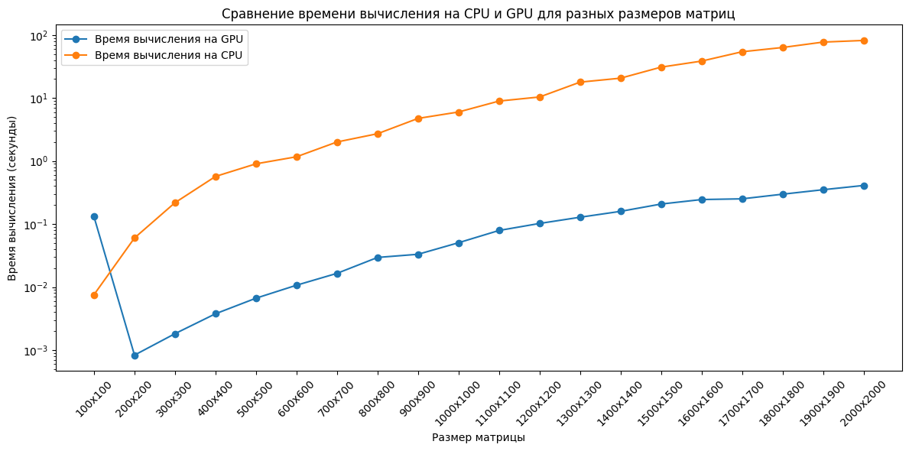
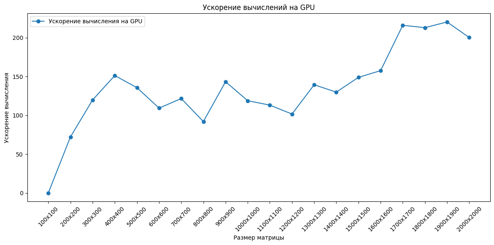

<h1>Matrix Multiplication</h1>
<h2>Постановка цели эксперимента</h2>

Цель – исследовать ускорение при произведении матриц на CUDA относительно последовательной реализации.

Задачи:
1.	Рассчитать время, достигаемое последовательной реализацией алгоритма.
2.	Рассчитать время и ускорение, достигаемое с использованием написанной параллельной реализации на CUDA.
3.	Проанализировать результат, сделать выводы.

<h2>Инструментальные средства эксперимента</h2>
<h3>Программные средства</h3>
Язык программирования – C++. 
Последовательная реализация:

```
void matrix_mul_cpu(float* a, float* b, float* c, int n){
    for(int i = 0; i<n; i++){
        for(int j = 0; j<n; j++){
            c[i*n+j]=0;
            for(int k = 0; k<n; k++){
                c[i*n+j] += a[k*n+j]*b[i*n+k];
            }
        }
    }
}
```

Параллельная реализация:
BLOCK_SIZE = (4, 4)

```
__global__ void kernelMatMul(float* a, float* b, float* c, int n) {
  // идентификатор нити по строке и столбцу
  int idx = blockDim.x*blockIdx.x+threadIdx.x; // строка
  int idy = blockDim.y*blockIdx.y+threadIdx.y; // столбец
  float sum = 0;
  // Проверяем, что текущие индексы строки и столбца находятся в пределах матрицы
  if (idx<n&&idy<n){
    // Выполняем умножение элементов строки матрицы a и столбца матрицы b
    for(int i = 0; i<n; i++) c[idx+idy*n]+= a[idy*n+i]*b[i*n+idx];
  }
}
```

Суть решения каждой нити посчитать значения в умноженной матрице (из последовательного цикла проход по k)

<h3>Среда выполнения - Google Colab(https://colab.research.google.com/drive/1MrhFrit_LVPS50AGmhMi59fU5KB5yOrx?usp=sharing)</h3>

На рисунке 1 изображено время выполнения программы



Рисунок 1 - время выполнения программы

На рисунке 2 изображено ускорение полученное на GPU



Рисунок 2 - ускорение программы


Рисунок 2 - ускорение программы

Таблица 1 - полученные результаты времени работы и ускорения
| Размер матрицы | Время CPU (сек) | Время GPU (сек) | Ускорение |
|----------------|-----------------|-----------------|-----------|
| 100x100        | 0.007556        | 0.130808        | 0.05776405113 |
| 200x200        | 0.060094        | 0.000831        | 72.31528279   |
| 300x300        | 0.218075        | 0.001819        | 119.8873007   |
| 400x400        | 0.569492        | 0.003765        | 151.2594954   |
| 500x500        | 0.903112        | 0.006656        | 135.6838942   |
| 600x600        | 1.16867         | 0.01069         | 109.323667    |
| 700x700        | 2.00625         | 0.016497        | 121.6130205   |
| 800x800        | 2.71389         | 0.029494        | 92.0149861    |
| 900x900        | 4.74667         | 0.033115        | 143.3389703   |
| 1000x1000      | 6.00301         | 0.050503        | 118.8644239   |
| 1100x1100      | 8.95069         | 0.079088        | 113.1738064   |
| 1200x1200      | 10.3855         | 0.102161        | 101.658167    |
| 1300x1300      | 17.8777         | 0.128247        | 139.4005318   |
| 1400x1400      | 20.6567         | 0.158992        | 129.9228892   |
| 1500x1500      | 30.9289         | 0.207655        | 148.9436806   |
| 1600x1600      | 38.569          | 0.244723        | 157.6026773   |
| 1700x1700      | 54.2573         | 0.25118         | 216.0096345   |
| 1800x1800      | 63.3968         | 0.29763         | 213.0054094   |
| 1900x1900      | 77.2375         | 0.350591        | 220.3065681   |
| 2000x2000      | 82.001          | 0.409434        | 200.2789216   |

<h2> Выводы <h2>

(необходимо уточнить, что время GPU считалось с пересылками между хостом и девайсом)

- Время выполнения на GPU значительно меньше, чем на CPU для всех размеров матриц, особенно при увеличении размера. Это показывает, что для крупных вычислительных задач GPU предоставляет значительное ускорение по сравнению с CPU.

- Было достигнуто значительное ускорение (это происходит потому, что нет нужды проходить NxN цикл) (но при этом, не всегда достигается ускорение относительно предыдущего шага размера матрицы, возможно это происходит из-за особенностей планировщика)