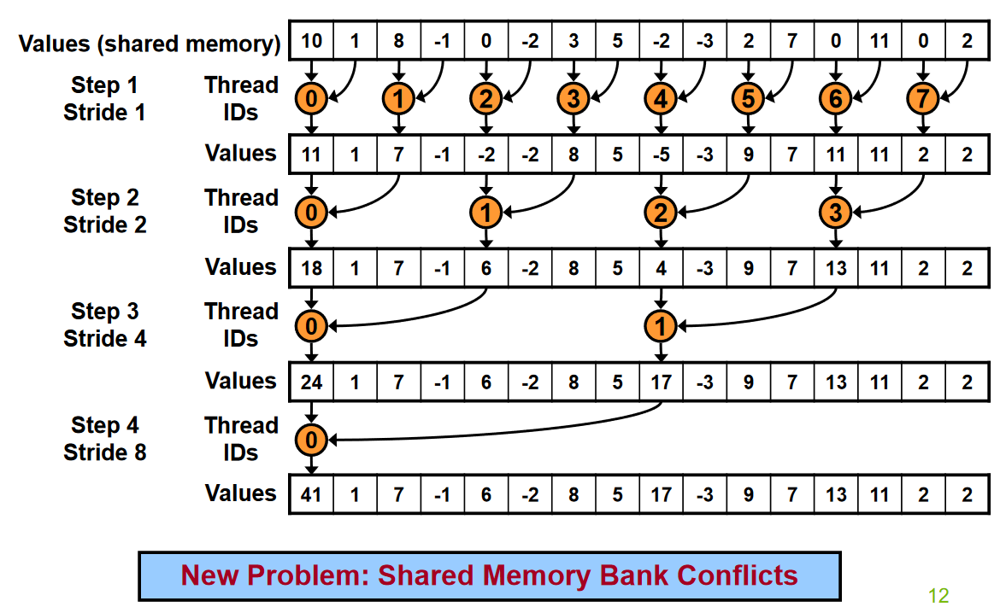
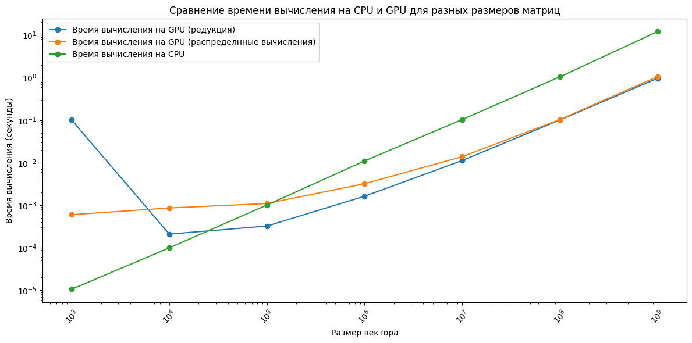
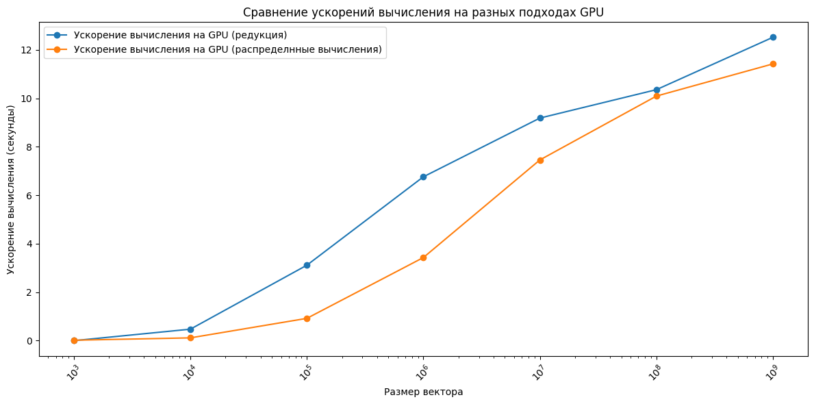

<h1>Vector Sum</h1>
<h2>Постановка цели эксперимента</h2>

Цель – исследовать ускорение при вычислении суммы вектора на CUDA относительно последовательной реализации.

Задачи:
1.	Рассчитать время, достигаемое последовательной реализацией алгоритма.
2.	Рассчитать время и ускорение, достигаемое с использованием написанной параллельной реализации на CUDA.
3.	Проанализировать результат, сделать выводы.

<h2>Инструментальные средства эксперимента</h2>
<h3>Программные средства</h3>
Язык программирования – C++. 

Последовательная реализация:

```
int sum_vector_cpu(const std::vector<int>& vec) {
    return std::accumulate(vec.begin(), vec.end(), 0);
}
```

Параллельные реализации:

Были взяты на основе https://developer.download.nvidia.com/compute/cuda/1.1-Beta/x86_website/projects/reduction/doc/reduction.pdf, слайды 7 и 11.



```
__global__ void sum_reduction(const int *input, int *output, int size) {
    __shared__ int shared_data[BLOCK_SIZE];

    int tid = threadIdx.x;
    int i = blockIdx.x * blockDim.x + threadIdx.x;

    // Инициализируем shared memory (заполняем в общей памяти блока элементы)
    shared_data[tid] = (i < size) ? input[i] : 0;
    __syncthreads();

    // Сумма сокращения
    for (int stride = blockDim.x / 2; stride > 0; stride >>= 1) {
        // суть в том, что сначала мы рассчитываем значение для половины массива, потом для оставшейся половины и т.д. пока не дойдем то 1 элемента
        if (tid < stride) {
            shared_data[tid] += shared_data[tid + stride];
        }
        // синхронизация, чтобы все потоки досчитали значения
        __syncthreads();
    }

    // Сохраняем результат блока (элемент, который хранит сумму всего блока)
    if (tid == 0) {
        output[blockIdx.x] = shared_data[0];
    }
}
```


Также был реализован вариант распределения вычислений для одной нити:


```
__global__ void distributed_sum_reduction(const int *input, int *output, int size, int elements_per_thread) {
    __shared__ int shared_data[BLOCK_SIZE];

    int tid = threadIdx.x;
    int block_start_index = blockIdx.x * blockDim.x * elements_per_thread;
    int local_sum = 0;

    // Каждая нить суммирует свои элементы
    for (int i = 0; i < elements_per_thread; ++i) {
        int index = block_start_index + tid * elements_per_thread + i;
        if (index < size) {
            local_sum += input[index];
        }
    }

    // Сохраняем локальную сумму нити в shared memory
    shared_data[tid] = local_sum;
    __syncthreads();

    // Суммирование в одной нити (например, нить 0) для блока
    if (tid == 0) {
        int block_sum = 0;
        for (int i = 0; i < blockDim.x; ++i) {
            block_sum += shared_data[i];
        }
        output[blockIdx.x] = block_sum;  // Сохраняем итоговую сумму блока
    }
}
```

Суть этого подхода в том, что каждому потоку мы даем выполнить elements_per_thread суммирований (которые записываются в shared памать), а дальше производим суммирование внутри блока

<h3>Среда выполнения - Google Colab(https://colab.research.google.com/drive/1NBvGXqmBlPh2nwKG1DMS8uWDubHeFySg?usp=sharing)</h3>

На рисунке 1 изображено время выполнения программы



Рисунок 1 - время выполнения программы

На рисунке 2 изображено ускорение полученное на GPU



Рисунок 2 - ускорение программы


| Размер вектора | Время CPU (сек) | Время GPU (редукция) (сек) | Время GPU (распределенные вычисления) (сек) | Ускорение (редукция) | Ускорение (распределенные вычисления) |
|----------------|-----------------|----------------------------|---------------------------------------------|-----------------------|----------------------------------------|
| 1,000          | 1.06E-05        | 0.101071                   | 0.00059941                                 | 1.05E-04              | 1.77E-02                               |
| 10,000         | 9.95E-05        | 0.000209653                | 0.000862833                                | 4.74E-01              | 1.15E-01                               |
| 100,000        | 0.00101082      | 0.00032446                 | 0.00109748                                 | 3.115391728           | 0.9210372854                           |
| 1,000,000      | 0.0110185       | 0.00162879                 | 0.00321092                                 | 6.764837702           | 3.431571014                            |
| 10,000,000     | 0.103463        | 0.011259                   | 0.0138671                                  | 9.189359623           | 7.461040881                            |
| 100,000,000    | 1.04488         | 0.100844                   | 0.103488                                   | 10.3613502            | 10.09662956                            |
| 1,000,000,000  | 12.0397         | 0.961385                   | 1.05378                                    | 12.52328672           | 11.42525005                            |

<h2> Выводы <h2>

(необходимо уточнить, что время GPU считалось с пересылками между хостом и девайсом)

- Для малых размеров вектора нет смысла использовать распараллеливание (так как время на накладные расходы значительно больше времени расчетов)
- На больших размерах данных достигнуто многократное ускорение ускорение 
- Параллельная реализация на основе редукции дала более выгодный прирост (но возможно это возникает из-за того, что был задан большой размер elements_per_thread и с меньшим размером, прирост был бы более значительным)